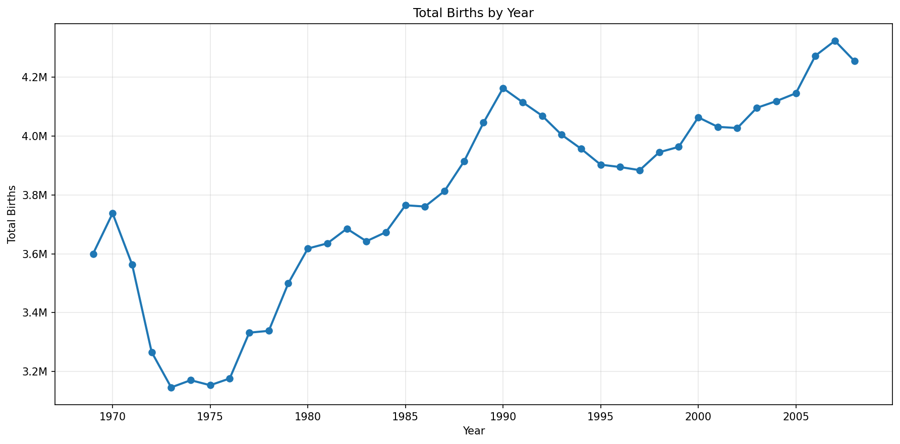
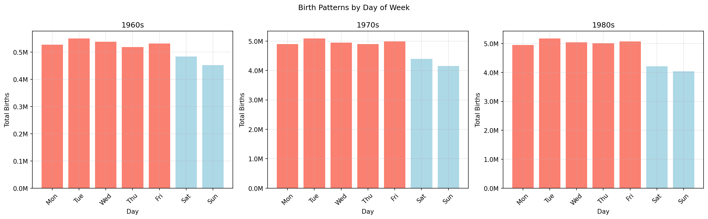
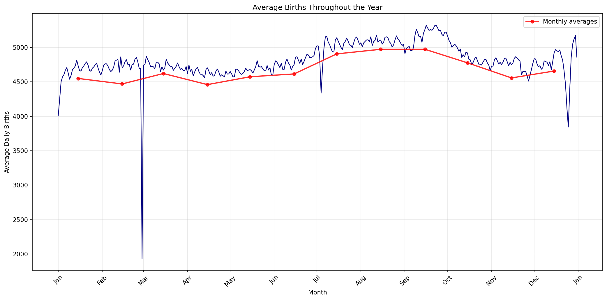

# Problem Sets 1 & 2

## Problem 1: CDC Births Data Analysis (Descriptive Analytics)

### Dataset
**Source**: CDCbirths.csv (not here)

### Generated Visualizations

#### 1. Births by Year Trends

**Key Findings:**
- Cyclical patterns with periods of increase and decrease
- Notable changes between consecutive decades
- Overall pattern reflects broader demographic and social changes

#### 2. Births by Weekday (1960s-1980s)

**Key Findings:**
- Consistent patterns across three decades
- Weekends have fewer births than weekdays
- Tuesday through Thursday are peak birth days
- Pattern suggests medical scheduling influences birth timing

#### 3. Seasonal Birth Patterns

**Key Findings:**
- September shows highest average births
- Summer and early fall represent peak birth season
- Christmas and New Year period show notable dips
- Winter months have lowest birth rates

---

## Problem 2: ICU Mortality Prediction (Predictive Analytics)

### Dataset
- **Source**: Physionet 2012 Challenge ICU Dataset
- **Training samples**: 2,000 patients
- **Testing samples**: 1,000 patients
- **Features**: 112 physiological measurements
- **Mortality rate**: 14.1% (training), 14.0% (testing)

### Algorithms Evaluated

#### 1. Logistic Regression
- **Test Accuracy**: 86.40%
- **Test AUROC**: 0.8272
- **Best overall performance with good generalization**

#### 2. Random Forest
- **Best Configuration**: Max depth 5, 500 estimators
- **Test Accuracy**: 86.90%
- **Test AUROC**: 0.8240
- **Competitive performance with moderate overfitting**

#### 3. Support Vector Machines
- **Best Configuration**: C=0.1, RBF kernel
- **Test Accuracy**: 86.00%
- **Test AUROC**: 0.8160
- **Prone to overfitting with high C values**

### Key Findings

#### Performance Comparison
1. **Logistic Regression**: 0.8272 AUROC, 86.40% Accuracy (Best AUROC)
2. **Random Forest**: 0.8240 AUROC, 86.90% Accuracy (Best Accuracy)
3. **SVM**: 0.8160 AUROC, 86.00% Accuracy